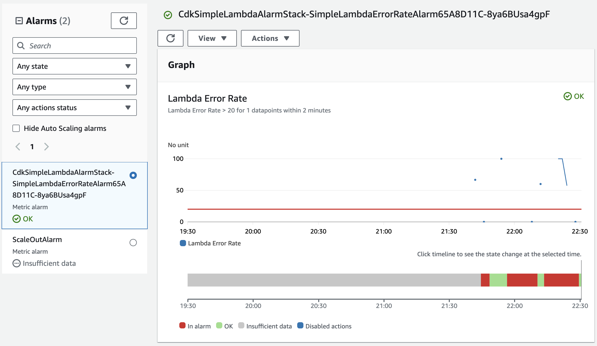

# Lambda and alarms

Simple CDK project that generates a Lamnbda function accepting a JSON event with an `error` field that can either be true or false.
When true the lambda goes into error, allowing us to test the CloudWatch alarm associated with it.



You can invoke the lambda using the AWS CLI like this : 

```
aws lambda invoke --function-name FUNCTION_NAME --invocation-type RequestResponse --cli-binary-format raw-in-base64-out --payload '{"error": true}' output.txt
```

## Useful commands

* `npm run build`   compile typescript to js
* `npm run watch`   watch for changes and compile
* `npm run test`    perform the jest unit tests
* `npx cdk deploy`  deploy this stack to your default AWS account/region
* `npx cdk diff`    compare deployed stack with current state
* `npx cdk synth`   emits the synthesized CloudFormation template
